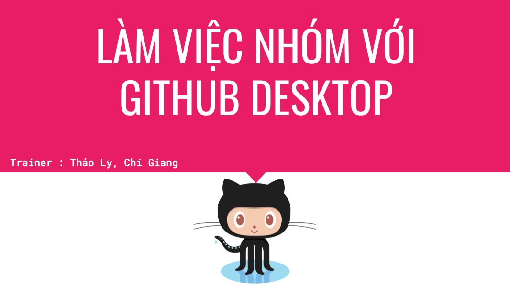

# Training: Làm việc nhóm với Github Desktop

## Tài liệu
- Video record: 
- Slide: 

## Nội dung
### 1. Tổng quan
- Hệ thống quản lý phiên bản (Version Control System), Git, Github là gì?
- Sử dụng commandline hay app?
- Tại sao nên dùng Github Desktop thay cho Git của Android Studio/VS Code?
- Workflows của Git
- Branch là …? Tại sao phải dùng Branch trong project?
- Merge là như thế nào, Pull request ra sao ?

### 2. Demo
- Đăng nhập Github
- Tạo repo
- ...